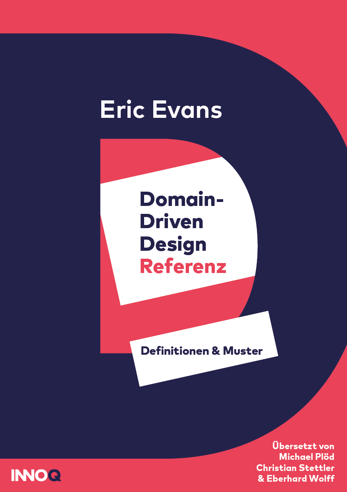

# DDD Referenz

Die Domain-driven Design Referenz gibt einen Überblick über die
grundlegenden Pattern für Domain-driven Design. Domain-driven Design
ist ein Ansatz für die Architektur und das Design von
Software-Projekten, das sich konsequent nach den fachlichen
Anforderungen richtet.

Die Referenz wurde vom Erfinder von DDD, Eric Evans, in Englisch
verfasst. Da das Werk unter einer Creative-Commons-Attribution-Lizenz
steht, war es problemlos möglich, dier Referenz auf Deutsch zu
übersetzen. Auch die deutsche Version steht unter einer
Creative-Commons-Attribution-Lizenz.

Der KOSTENLOSE Download für das eBook findet sich bei [Leanpub](https://leanpub.com/ddd-referenz/).

Der Quellcode als Markdown findet sich unter
[https://github.com/ddd-referenz/ddd-referenz](https://github.com/ddd-referenz/ddd-referenz) .
